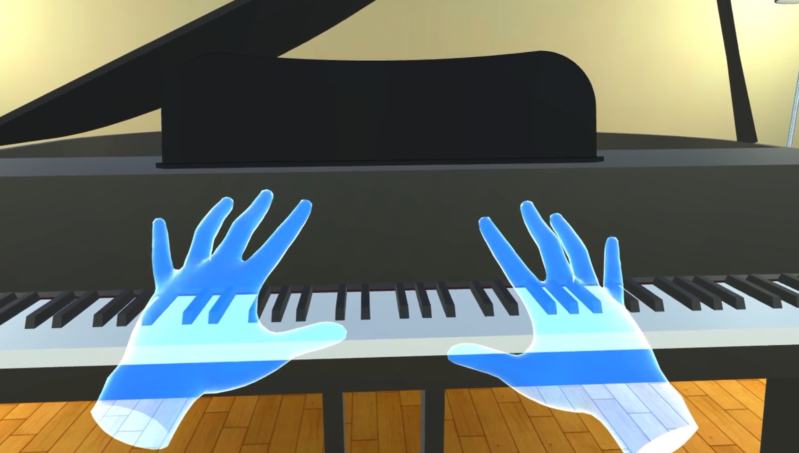
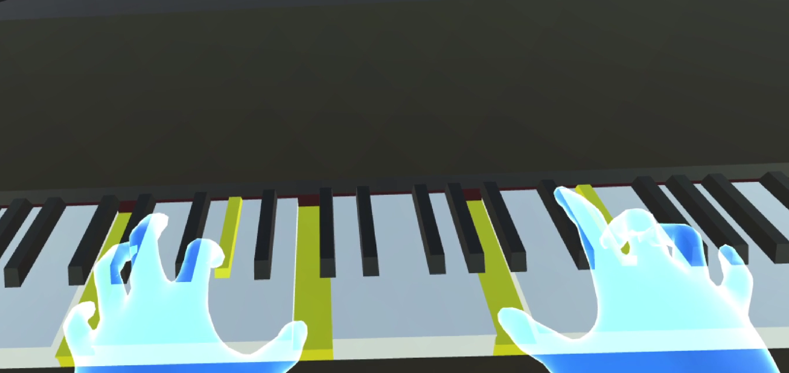
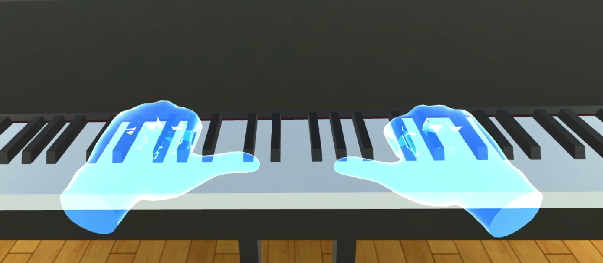
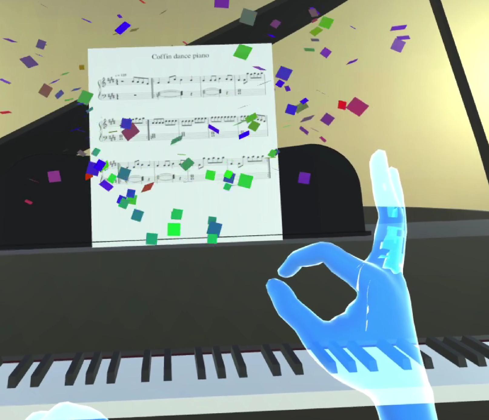
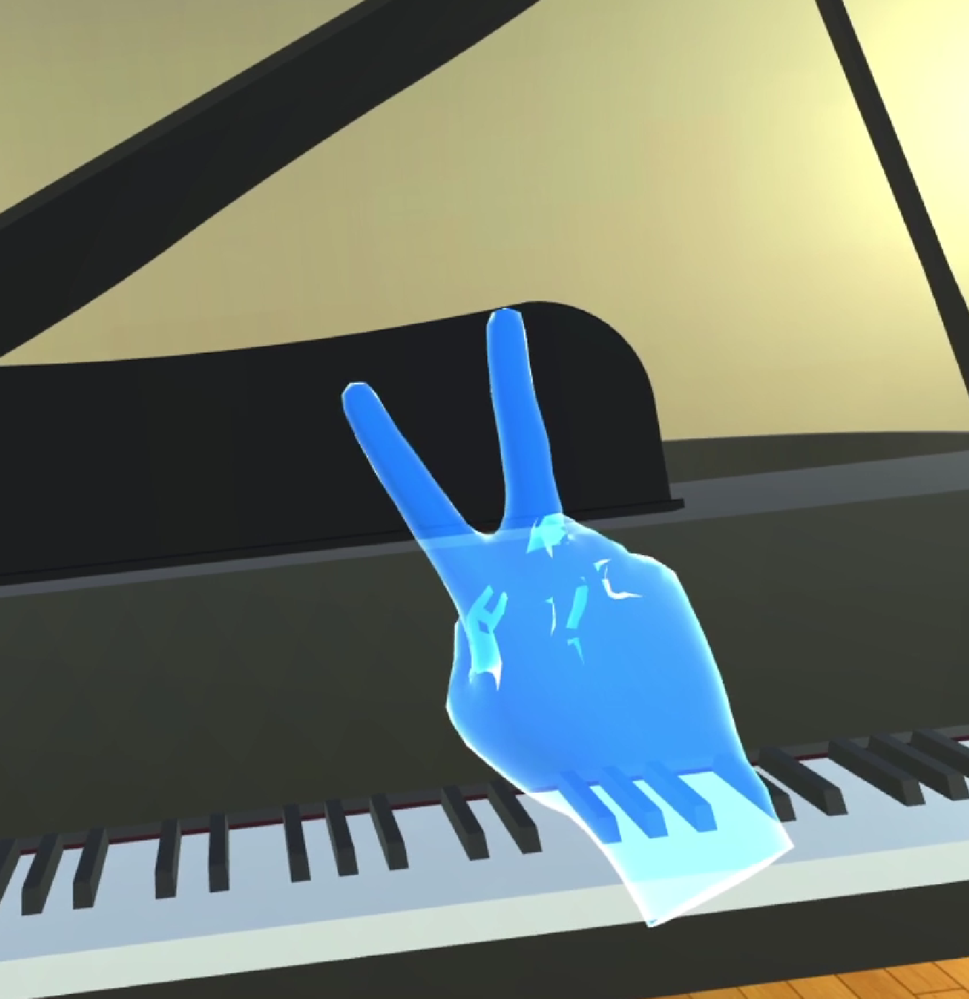

# Title
Piano VR

---

# Description
```
Данная разработка позволяет пользователю играть на пианино в виртуальной реальности с использованием Oculus Quest или Oculus Quest 2. 
Существует два режима - свободный и обучающий. В обучающем режиме, пользователю будет предложено на выбор несколько песен для обучения. После выбора интересующей песни, появляются ноты с указателем на текущую ноту на которую нужно нажать, также подсвечивается сама клавиша. В проекте присутствуют пасхалки, поэтому можете попробовать их вызвать с помощью различных жестов!
```

---

# Images
* 
* 
* 
* 
* 

---

# Tags
* VR
* Education
---
# Tech
* Unity
* C#
* Oculus Integration
---
# Developers
* Пушкин А.А.
---
# Site
---
# SourceCode
| name | link |
| - | - |
| GitHub | https://github.com/pushkinman/Piano_Quest |

---
